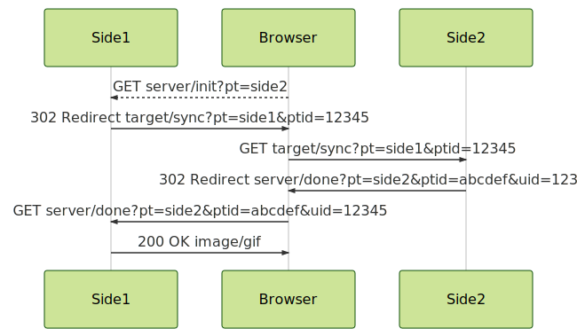

# Rockstat cookie-sync service example

For configuration example look at `config.yml`

## Clone

Open Theia IDE, new terminal, then clone to `my_images` with `cookiesync` name.

```
cd my_images
git clone https://github.com/rockstat/cookie-sync-service.git cookiesync
```

## Hot to start

For testing purposes run `make start-dev`.
Suppose your at `my_images/` folder

```
cd cookiesync
make start-dev
```

To start service in production mode use Rockstat dashboard located at `app.YOUR-TRACKING-DOMAIN`

## Synchronization


`init` -> `sync` -> `done` but depends on initiator side can be:

- `init:local` -> `sync:remote` -> `done:local`
- `init:remote` -> `sync:local` -> `done:remote`




#### Initialize synchronization

Start at `i` - `init`
`https://YOURDOMAIN/cookiesync/i?p={partner}`.

Will be redirected to partner `s` - `sync` location. Otherwice pixel will be returned and written error to logs.


#### Synchronization process

`https://YOURDOMAIN/cookiesync/sync?p={partner}&pi={partner_id}`.

Will be redirected to partner `done` location. If error occur will be returned pixel.

#### Finishing process

Receiving syncronization results and show pixel `d` - `done`

`https://YOURDOMAIN/cookiesync/done?p={partner_name}&pi={partner_id}&ui={user_id}`.

#### Getting matches

Matched available via RPC method `matches`

```py
from band import rpc
matches = await rpc.request('cookiesync', 'matches', uid=uidvar)
```

call emulation:

```
curl http://127.0.0.1:10000/call/cookiesync/matches?uid=6461045793582219264
{"rstatbolt":"6450101900745375744"}
```

## Env variables

Possible to store vars at: `.env`, `.env.local`.
These paths was excluded from git to avoid of commit sensitive data.

## License

```
Copyright 2018 Dmitry Rodin

Licensed under the Apache License, Version 2.0 (the "License");
you may not use this file except in compliance with the License.
You may obtain a copy of the License at

    http://www.apache.org/licenses/LICENSE-2.0

Unless required by applicable law or agreed to in writing, software
distributed under the License is distributed on an "AS IS" BASIS,
WITHOUT WARRANTIES OR CONDITIONS OF ANY KIND, either express or implied.
See the License for the specific language governing permissions and
limitations under the License.
```
