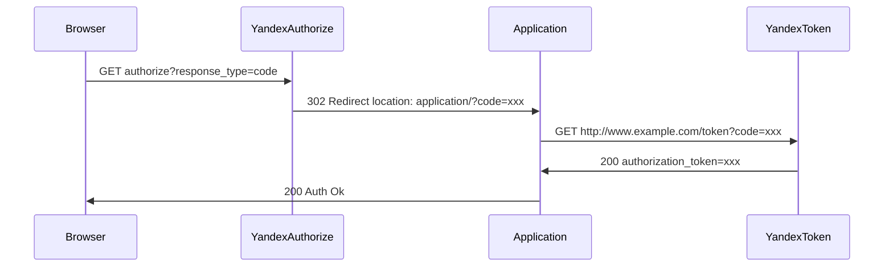

https://oauth.yandex.ru/authorize?
   response_type=code

```mermaid


sequenceDiagram
    participant Browser
    participant YandexAuthorize
    
    Browser->>YandexAuthorize: GET authorize?response_type=code
    YandexAuthorize->>Application: 302 Redirect location: application/?code=xxx
    Application->>YandexToken: GET http://www.example.com/token?code=xxx
    YandexToken->>Application: 200 authorization_token=xxx
    Application->>Browser: 200 Auth Ok

```